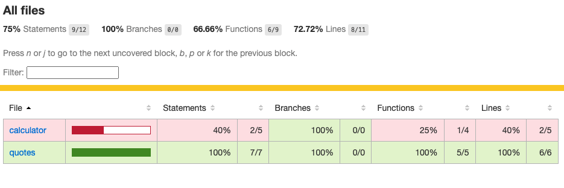
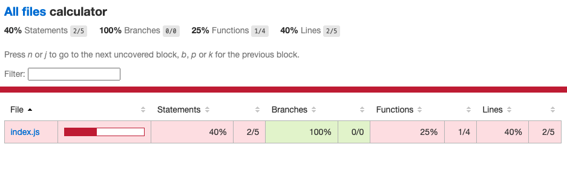
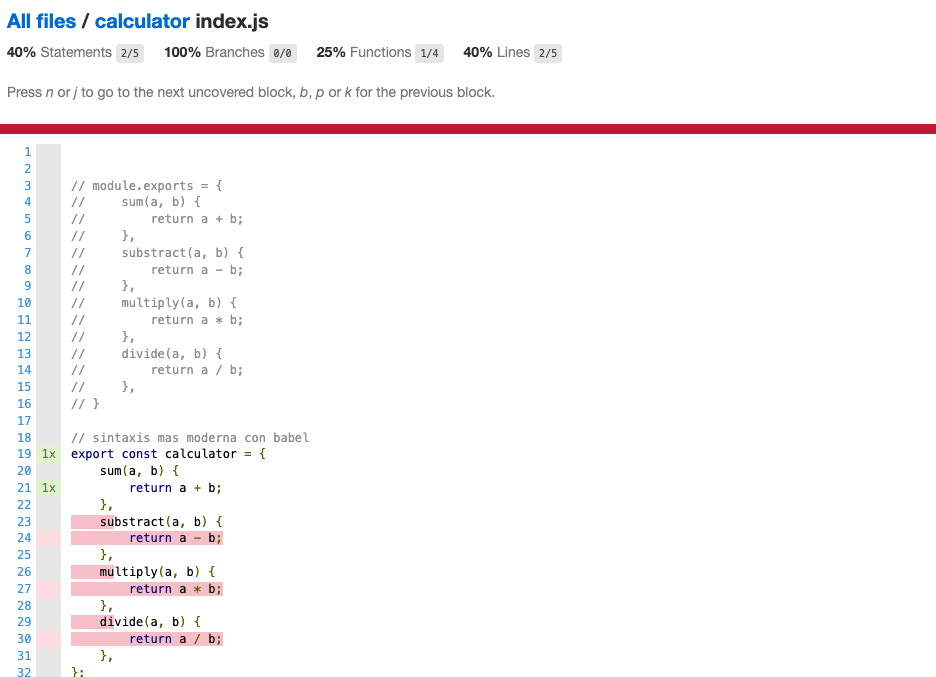
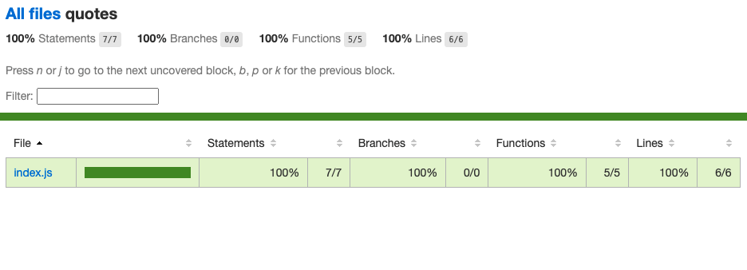

# Introduction to Unit test w/ Jest

## Topics

- describe scope
- it scope 
- test scope 

- test.todo for a test that not be defined

- Object Assignments
- Falsy and Truthy values
- Numerics test
- Floating numeric test 
- strings test
- the not matchers for negation
- toMatch to test w/ regExp
- Arrays test
- Handle Exception test
- Create your own matchers for the win
- the methods for control the flow of the tests 
    - beforeAll
    - afterAll
    - beforeEach
    - afterEach
- Promises test ( util for REST Services ) in three differents ways
    - async/await
    - Promises
    - Callbacks

- Use the option from the jest cli 
    - coverageAll
    - watchAll

### Coverage report captures

